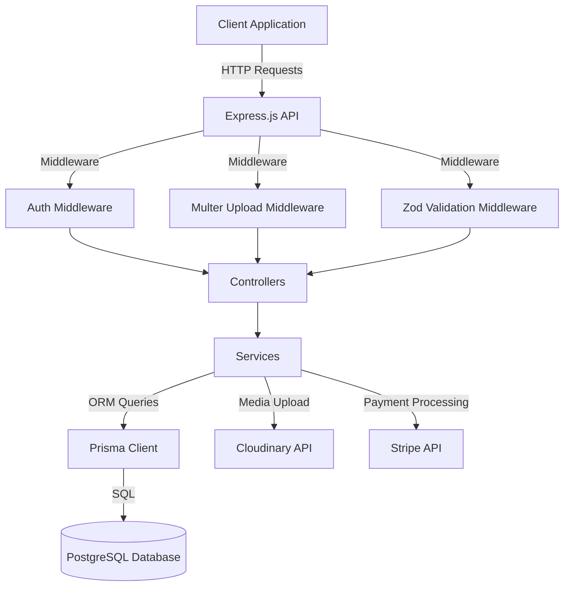
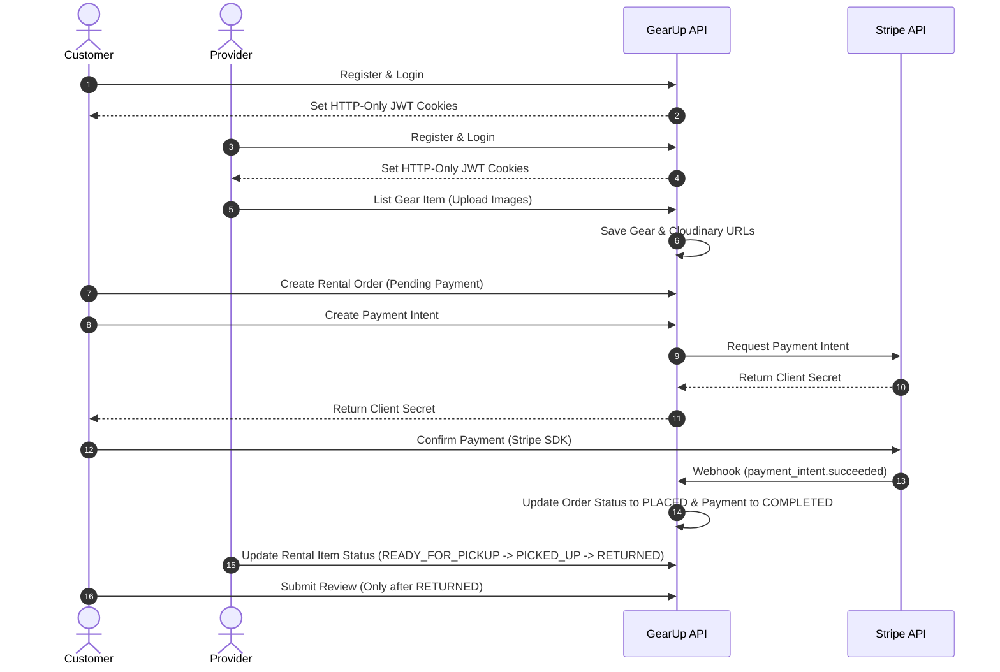

# 🚀 GearUp Backend API

**GearUp** is a robust, enterprise-grade backend API for an outdoor gear rental platform. It enables seamless gear sharing, rental management, secure payments, and user reviews. Built with modern technologies, it features role-based access control (RBAC), real-time availability calculations, and automated payment processing.

---

# 🔖 Badges

[](https://nodejs.org/)
[](https://expressjs.com/)
[](https://www.typescriptlang.org/)
[](https://www.postgresql.org/)
[](https://www.prisma.io/)
[](https://jwt.io/)
[](https://stripe.com/)
[](https://cloudinary.com/)
[](https://github.com/expressjs/multer)

---

# 📑 Table of Contents

- [Features](#-features)
- [Tech Stack](#-tech-stack)
- [Project Architecture](#-project-architecture)
- [Folder Structure](#-folder-structure)
- [Database Design](#-database-design)
- [API Flow](#-api-flow)
- [Authentication](#-authentication)
- [API Endpoints](#-api-endpoints)
- [Validation](#-validation)
- [Error Response Format](#-error-response-format)
- [Success Response Format](#-success-response-format)
- [Environment Variables](#-environment-variables)
- [Installation](#-installation)
- [Deployment](#-deployment)
- [Stripe Integration](#-stripe-integration)
- [Security](#-security)
- [Screenshots](#-screenshots)
- [API Documentation](#-api-documentation)
- [Future Improvements](#-future-improvements)
- [Author](#-author)
- [License](#-license)

---

# ✨ Features

### Public Features

- **Browse Gear Items**: Filter, search, and paginate listed gear items.
- **Category Navigation**: Explore gear items organized by hierarchical categories.
- **Check Availability**: Real-time date-based availability checks for any gear item.
- **View Reviews**: Read verified customer reviews and ratings for gear items.

### Customer Features

- **Profile Management**: Retrieve and update personal profile details, change passwords.
- **Rental Management**: Create rental orders, view personal rental history, and cancel pending rentals.
- **Reviews**: Submit ratings and comments for returned gear items.

### Provider Features

- **Gear Management**: List new gear items with multiple images, update gear details, and delete listings.
- **Rental Tracking**: View rental requests for owned gear and update item rental statuses (e.g., `READY_FOR_PICKUP`, `PICKED_UP`, `RETURNED`).
- **Dashboard**: Access provider-specific analytics (earnings, active rentals, gear stats).

### Admin Features

- **Category Management**: Create, update, and delete hierarchical categories.
- **User Management**: Monitor user accounts and suspend/activate users.
- **Dashboard**: Access platform-wide analytics (total revenue, user growth, rental volume).

### Payment Features

- **Stripe Integration**: Secure payment intent creation and confirmation.
- **Stripe Webhook**: Automated, asynchronous payment status updates and order placement.

### Security Features

- **Role-Based Access Control (RBAC)**: Strict route protection for `CUSTOMER`, `PROVIDER`, and `ADMIN`.
- **Secure Authentication**: HTTP-only cookie-based JWT access and refresh tokens.

---

# 🛠 Tech Stack

- **Backend**: Node.js, Express.js (v5.x), TypeScript (v6.x)
- **Database**: PostgreSQL, Prisma ORM (v7.x)
- **Authentication**: JSON Web Tokens (JWT), bcryptjs
- **Payment Gateway**: Stripe API
- **Cloud Storage**: Cloudinary, Multer, Multer Storage Cloudinary
- **Validation**: Zod
- **Deployment**: Render, Railway, Neon (PostgreSQL)

---

# 🏗 Project Architecture



---

# 📂 Folder Structure

```
prisma-gearup-backend/
├── generated/                  # Generated Prisma Client
├── prisma/
│   ├── migrations/             # Database migrations
│   └── schema/                 # Modular Prisma schema files
│       ├── category.prisma
│       ├── enums.prisma
│       ├── gearImage.prisma
│       ├── gearItem.prisma
│       ├── payment.prisma
│       ├── rentalOrder.prisma
│       ├── rentalOrderItem.prisma
│       ├── review.prisma
│       ├── schema.prisma
│       └── user.prisma
├── src/
│   ├── app.ts                  # Express application setup
│   ├── server.ts               # Server entry point
│   ├── app/
│   │   ├── config/             # Configuration files (Cloudinary, Env)
│   │   ├── constants.ts/       # Global constants
│   │   ├── errors/             # Custom error classes and handlers
│   │   ├── middlewares/        # Global middlewares (Auth, Multer, Error)
│   │   ├── modules/            # Feature modules (MVC/Service pattern)
│   │   │   ├── auth/
│   │   │   ├── category/
│   │   │   ├── dashboard/
│   │   │   ├── gear/
│   │   │   ├── payment/
│   │   │   ├── rental/
│   │   │   ├── review/
│   │   │   └── user/
│   │   ├── routes/             # Global router aggregator
│   │   └── utils/              # Utility functions (Pagination, Response)
│   ├── lib/                    # Library initializations (Prisma, JWT)
│   └── types/                  # TypeScript declarations
├── package.json
├── tsconfig.json
└── gearup.postman_collection.json
```

---

# 🗃 Database Design

### Models Explanation

- **User**: Represents platform users with roles (`CUSTOMER`, `PROVIDER`, `ADMIN`) and statuses (`ACTIVE`, `SUSPENDED`, `VERIFICATION_PENDING`).
- **Category**: Hierarchical category model supporting parent-child relationships for gear classification.
- **GearItem**: Gear listings owned by a `PROVIDER` and belonging to a `Category`. Real-time availability is computed dynamically.
- **GearImage**: Stores image URLs hosted on Cloudinary, supporting a single primary image per gear item.
- **RentalOrder**: Tracks the overall rental transaction, total amount, and payment status.
- **RentalOrderItem**: Individual gear items within a rental order, tracking rental dates, quantities, and rental statuses.
- **Payment**: Records payment transactions, transaction IDs, and gateway responses.
- **Review**: Customer reviews and ratings linked to specific returned rental items.

### Entity-Relationship (ER) Diagram

```mermaid
erDiagram
    USER {
        String id PK
        String name
        String email UK
        String password
        Role role
        UserStatus status
    }
    CATEGORY {
        String id PK
        String name UK
        String slug UK
        String parentId FK
    }
    GEAR_ITEM {
        String id PK
        String name
        String slug UK
        Decimal pricePerDay
        Int totalQuantity
        Boolean isListed
        String providerId FK
        String categoryId FK
    }
    GEAR_IMAGE {
        String id PK
        String imageUrl
        Boolean isPrimary
        String gearItemId FK
    }
    RENTAL_ORDER {
        String id PK
        String orderNumber UK
        OrderStatus status
        PaymentStatus paymentStatus
        Decimal totalAmount
        String customerId FK
    }
    RENTAL_ORDER_ITEM {
        String id PK
        Int quantity
        Decimal pricePerDay
        Decimal subtotal
        DateTime startDate
        DateTime endDate
        ItemRentalStatus status
        String rentalOrderId FK
        String gearItemId FK
    }
    PAYMENT {
        String id PK
        String transactionId UK
        Decimal amount
        PaymentMethod method
        PaymentStatus status
        String rentalOrderId FK
    }
    REVIEW {
        String id PK
        Int rating
        String comment
        String customerId FK
        String gearItemId FK
        String rentalOrderItemId FK UK
    }

    USER ||--o{ GEAR_ITEM : "lists"
    USER ||--o{ RENTAL_ORDER : "places"
    USER ||--o{ REVIEW : "writes"
    CATEGORY ||--o{ GEAR_ITEM : "classifies"
    CATEGORY ||--o{ CATEGORY : "parent-child"
    GEAR_ITEM ||--o{ GEAR_IMAGE : "has"
    GEAR_ITEM ||--o{ RENTAL_ORDER_ITEM : "rented-as"
    RENTAL_ORDER ||--|{ RENTAL_ORDER_ITEM : "contains"
    RENTAL_ORDER ||--o{ PAYMENT : "has"
    GEAR_ITEM ||--o{ REVIEW : "receives"
    RENTAL_ORDER_ITEM ||--o{ REVIEW : "reviewed-by"
```

---

# 🔄 API Flow



---

# 🔐 Authentication & Authorization

### JWT Flow

1. **Login**: User submits credentials. On success, the server generates an Access Token and a Refresh Token.
2. **Token Storage**: Both tokens are set as secure, HTTP-only cookies to prevent XSS attacks.
3. **Authorization**: The `auth` middleware extracts the token from cookies or the `Authorization: Bearer <token>` header, verifies it, and attaches the user payload to `req.user`.

### Role-Based Access Control (RBAC)

Routes are protected using the `auth(...roles)` middleware. Only users with matching roles can access specific endpoints:

- `Role.ADMIN`: Full platform control, category management, global dashboards.
- `Role.PROVIDER`: Gear listing, rental status updates, provider dashboards.
- `Role.CUSTOMER`: Rental creation, payments, reviews, customer dashboards.

---

# 📡 API Endpoints

### Auth Endpoints

| Method | URL                  | Allowed Roles | Description                       |
| :----- | :------------------- | :------------ | :-------------------------------- |
| `POST` | `/api/v1/auth/login` | Public        | Authenticate user and set cookies |

### Users Endpoints

| Method  | URL                             | Allowed Roles                   | Description                   |
| :------ | :------------------------------ | :------------------------------ | :---------------------------- |
| `POST`  | `/api/v1/users/register`        | Public                          | Register a new user account   |
| `GET`   | `/api/v1/users/me`              | `CUSTOMER`, `PROVIDER`, `ADMIN` | Retrieve current user profile |
| `PATCH` | `/api/v1/users/me`              | `CUSTOMER`, `PROVIDER`, `ADMIN` | Update current user profile   |
| `PATCH` | `/api/v1/users/change-password` | `CUSTOMER`, `PROVIDER`, `ADMIN` | Change account password       |

### Categories Endpoints

| Method   | URL                      | Allowed Roles | Description                |
| :------- | :----------------------- | :------------ | :------------------------- |
| `POST`   | `/api/v1/categories`     | `ADMIN`       | Create a new category      |
| `GET`    | `/api/v1/categories`     | Public        | Retrieve all categories    |
| `GET`    | `/api/v1/categories/:id` | Public        | Retrieve a single category |
| `PATCH`  | `/api/v1/categories/:id` | `ADMIN`       | Update category details    |
| `DELETE` | `/api/v1/categories/:id` | `ADMIN`       | Delete a category          |

### Gear Endpoints

| Method   | URL                              | Allowed Roles | Description                                          |
| :------- | :------------------------------- | :------------ | :--------------------------------------------------- |
| `GET`    | `/api/v1/gears`                  | Public        | Retrieve all listed gear items (with search/filter)  |
| `GET`    | `/api/v1/gears/:id`              | Public        | Retrieve a single gear item                          |
| `GET`    | `/api/v1/gears/:id/availability` | Public        | Check real-time availability for specific dates      |
| `POST`   | `/api/v1/gears`                  | `PROVIDER`    | Create a new gear listing (supports up to 10 images) |
| `PATCH`  | `/api/v1/gears/:id`              | `PROVIDER`    | Update gear listing details                          |
| `DELETE` | `/api/v1/gears/:id`              | `PROVIDER`    | Delete a gear listing                                |

### Rentals Endpoints

| Method  | URL                                           | Allowed Roles | Description                                         |
| :------ | :-------------------------------------------- | :------------ | :-------------------------------------------------- |
| `POST`  | `/api/v1/rentals`                             | `CUSTOMER`    | Create a new rental order                           |
| `GET`   | `/api/v1/rentals/my-rentals`                  | `CUSTOMER`    | Retrieve customer's rental history                  |
| `GET`   | `/api/v1/rentals/provider/rentals`            | `PROVIDER`    | Retrieve rental orders for provider's gear          |
| `GET`   | `/api/v1/rentals/provider/rentals/:id`        | `PROVIDER`    | Retrieve a single rental order details for provider |
| `GET`   | `/api/v1/rentals/:id`                         | `CUSTOMER`    | Retrieve a single rental order details for customer |
| `PATCH` | `/api/v1/rentals/:id/cancel`                  | `CUSTOMER`    | Cancel a pending rental order                       |
| `PATCH` | `/api/v1/rentals/provider/rentals/:id/status` | `PROVIDER`    | Update rental item status                           |

### Payments Endpoints

| Method | URL                              | Allowed Roles | Description                              |
| :----- | :------------------------------- | :------------ | :--------------------------------------- |
| `POST` | `/api/v1/payments/create-intent` | `CUSTOMER`    | Create Stripe Payment Intent             |
| `POST` | `/api/v1/payments/confirm`       | `CUSTOMER`    | Confirm payment and update order status  |
| `POST` | `/api/v1/payments/webhook`       | Public        | Stripe Webhook endpoint for async events |
| `POST` | `/api/v1/payments`               | `CUSTOMER`    | Stripe Webhook endpoint for async events |
| `POST` | `/api/v1/payments/:id`              | `CUSTOMER`    | Stripe Webhook endpoint for async events |

### Dashboard Endpoints

| Method | URL                          | Allowed Roles | Description                                   |
| :----- | :--------------------------- | :------------ | :-------------------------------------------- |
| `GET`  | `/api/v1/dashboard/admin`    | `ADMIN`       | Retrieve platform-wide admin analytics        |
| `GET`  | `/api/v1/dashboard/provider` | `PROVIDER`    | Retrieve provider earnings and gear analytics |
| `GET`  | `/api/v1/dashboard/customer` | `CUSTOMER`    | Retrieve customer rental statistics           |

### Reviews Endpoints

| Method | URL                       | Allowed Roles | Description                                   |
| :----- | :------------------------ | :------------ | :-------------------------------------------- |
| `POST` | `/api/v1/reviews`         | `CUSTOMER`    | Submit a review for a returned rental item    |
| `GET`  | `/api/v1/reviews/:gearId` | Public        | Retrieve all reviews for a specific gear item |

---

# ✔ Validation

All incoming request payloads are strictly validated using **Zod** schemas before reaching the controllers. This ensures type safety and clean data entry.

Example Zod Schema for Gear Creation:

```typescript
export const createGearValidationSchema = z.object({
  name: z.string().min(1, "Name is required."),
  description: z.string().min(1, "Description is required."),
  brand: z.string().optional(),
  pricePerDay: z.number().positive("Price per day must be positive."),
  totalQuantity: z.number().int().positive("Quantity must be at least 1."),
  categoryId: z.string().min(1, "Category is required."),
});
```

---

# ❌ Error Response Format

The API uses a centralized error handling middleware to return consistent error structures:

```json
{
  "success": false,
  "statusCode": 400,
  "message": "Validation failed",
  "details": [
    {
      "field": "pricePerDay",
      "message": "Price per day must be positive."
    }
  ]
}
```

---

# ✅ Success Response Format

All successful API responses follow a standardized envelope:

```json
{
  "success": true,
  "statusCode": 200,
  "message": "Resource retrieved successfully.",
  "data": {
    "id": "cm1234567890",
    "name": "Camping Tent"
  },
  "meta": {
    "page": 1,
    "limit": 10,
    "total": 1
  }
}
```

---

# 🌍 Environment Variables

Create a `.env` file in the root directory and configure the following variables:

| Variable                 | Required | Description                                                    |
| :----------------------- | :------- | :------------------------------------------------------------- |
| `DATABASE_URL`           | Yes      | PostgreSQL connection string (with pooling/adapter parameters) |
| `PORT`                   | No       | Port number for the Express server (Default: `5000`)           |
| `NODE_ENV`               | No       | Environment mode (`development` or `production`)               |
| `CLIENT_URL`             | Yes      | Frontend application URL (for CORS configuration)              |
| `BCRYPT_SALT_ROUNDS`     | No       | Salt rounds for password hashing (Default: `10`)               |
| `JWT_ACCESS_SECRET`      | Yes      | Secret key for signing access tokens                           |
| `JWT_REFRESH_SECRET`     | Yes      | Secret key for signing refresh tokens                          |
| `JWT_ACCESS_EXPIRES_IN`  | No       | Expiration time for access tokens (Default: `1d`)              |
| `JWT_REFRESH_EXPIRES_IN` | No       | Expiration time for refresh tokens (Default: `30d`)            |
| `CLOUDINARY_CLOUD_NAME`  | Yes      | Cloudinary account cloud name                                  |
| `CLOUDINARY_API_KEY`     | Yes      | Cloudinary API key                                             |
| `CLOUDINARY_API_SECRET`  | Yes      | Cloudinary API secret                                          |
| `STRIPE_PRODUCT_ID`      | Yes      | Stripe product identifier for rentals                          |
| `STRIPE_SECRET_KEY`      | Yes      | Stripe secret API key                                          |
| `STRIPE_WEBHOOK_SECRET`  | Yes      | Stripe webhook signing secret                                  |

---

# ⚙ Installation & Setup

Follow these steps to set up the project locally:

1. **Clone the Repository**:

   ```bash
   git clone https://github.com/yourusername/gearup-backend.git
   cd gearup-backend
   ```

2. **Install Dependencies**:

   ```bash
   npm install
   ```

3. **Configure Environment Variables**:
   Create a `.env` file in the root directory and fill in the required variables listed in the [Environment Variables](#-environment-variables) section.

4. **Generate Prisma Client**:

   ```bash
   npm run generate
   ```

5. **Run Database Migrations**:

   ```bash
   npm run migrate
   ```

6. **Start the Development Server**:
   ```bash
   npm run dev
   ```

---

# 🚀 Deployment

### Database (Neon / Railway)

1. Create a PostgreSQL database instance on Neon or Railway.
2. Copy the connection string and set it as `DATABASE_URL` in your production environment.

### Backend (Render / Railway)

1. Connect your GitHub repository to Render or Railway.
2. Set the build command to:
   ```bash
   npm install && npm run generate && npm run build
   ```
3. Set the start command to:
   ```bash
   npm run start
   ```
4. Add all environment variables in the platform's dashboard.

### Stripe Webhook Configuration

1. In the Stripe Dashboard, navigate to **Developers > Webhooks**.
2. Add an endpoint pointing to `https://your-production-url.com/api/v1/payments/webhook`.
3. Select the `payment_intent.succeeded` event.
4. Copy the signing secret and set it as `STRIPE_WEBHOOK_SECRET` in your production environment.

---

# 💳 Stripe Integration

The platform utilizes Stripe for secure, asynchronous payment processing:

1. **Payment Intent Creation**: When a customer initiates a rental, the backend creates a Stripe Payment Intent with the total amount and returns the `clientSecret` to the frontend.
2. **Payment Confirmation**: The frontend uses the Stripe SDK to securely collect card details and confirm the payment directly with Stripe.
3. **Webhook Processing**: Upon successful payment, Stripe sends a secure POST request to the `/api/v1/payments/webhook` endpoint. The backend verifies the signature, processes the event, updates the `RentalOrder` status to `PLACED`, and marks the `Payment` status as `COMPLETED`.

---

# 🔒 Security Best Practices

- **Helmet**: Configured to secure Express apps by setting various HTTP headers.
- **CORS**: Restricted to the configured `CLIENT_URL` to prevent unauthorized cross-origin requests.
- **HTTP-Only Cookies**: JWTs are stored in HTTP-only, secure cookies to mitigate XSS and token theft.
- **Password Hashing**: Strong password hashing using `bcryptjs` with configurable salt rounds.
- **Input Sanitization & Validation**: Strict schema validation using Zod to prevent SQL injection and malformed payloads.
- **Role-Based Authorization**: Route-level middleware ensuring users can only access endpoints matching their assigned role.

---

# 📸 Screenshots

<details>
<summary>📸 Click to view platform screenshots</summary>

### Postman API Testing


### Database Schema (Prisma Studio)


### Stripe Payment Dashboard


### Cloudinary Media Library


</details>

---

# 📚 API Documentation

A complete Postman collection is included in the root directory of this repository:

- **File**: `gearup.postman_collection.json`
- **How to use**: Import this file into Postman to access pre-configured requests for all endpoints, including environment variables and authentication scripts.

---

# 🛣 Future Improvements

- [ ] **Real-time Chat**: Direct messaging between customers and providers.
- [ ] **Geo-location Search**: Find gear items near the customer's current location.
- [ ] **Multi-currency Support**: Support renting in multiple currencies via Stripe.
- [ ] **Automated Late Fee Calculation**: Cron jobs to automatically apply late fees for overdue items.
- [ ] **Push Notifications**: Real-time updates for rental status changes.

---

# 👨‍💻 Author

- **Your Name**
- GitHub: [@Alaminahmedariyan](https://github.com/Alaminahmedariyan)
- LinkedIn: [Your Profile](www.linkedin.com/in/alamin-ahmed-536463382)

---

# 📜 License

This project is licensed under the MIT License - see the [LICENSE](LICENSE) file for details.
